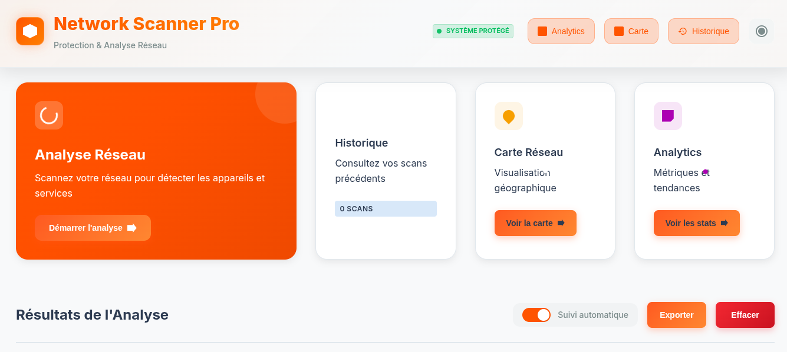

#  Network Scanner   

Une application moderne et complète de scanning réseau avec interface web, base de données intégrée et analytics avancés.





##  Fonctionnalités Principales

###  Scanning Réseau Avancé
- **Types de scan multiples** : Rapide, complet, par plage personnalisée
- **Support de formats** : CIDR (`192.168.1.0/24`), plages (`192.168.1.1-254`), IP individuelles
- **Détection de ports intelligente** : Scan automatique ou ports personnalisés
- **Identification de services** : Reconnaissance automatique des services sur ports ouverts
- **Scan asynchrone** : Performance optimisée avec gestion de la concurrence

## Installation et Démarrage

### Prérequis
- **Python 3.8+** (recommandé : Python 3.9+)
- **Système Linux/Unix**
- **Privilèges réseau**

### Installation Rapide

1. **Cloner le projet** :
```bash
git clone https://github.com/anis-metref/network-scanport.git
cd network-scanport
```

2. **Créer un environnement virtuel** (recommandé) :
```bash
python3 -m venv venv
source venv/bin/activate  # Linux/macOS
# ou
venv\Scripts\activate     # Windows
```

3. **Installer les dépendances** :
```bash
pip install -r requirements.txt
```

4. **Lancer l'application** :
```bash
python3 app.py
```

5. **Accéder à l'interface** :
Ouvrez votre navigateur sur : **http://localhost:5000**

### Installation Automatique
```bash
chmod +x install.sh
./install.sh
```

##  Guide d'Utilisation

###  Page Principale (Scanner)
L'interface principale offre un accès direct aux fonctionnalités de scan :

1. **Panneau de Configuration** :
   - **Cible** : Saisissez l'IP, réseau CIDR ou plage à scanner
   - **Type de scan** : Choisissez entre Rapide, Complet ou Plage personnalisée
   - **Ports** : Spécifiez des ports personnalisés ou laissez en automatique
   - **Interfaces réseau** : Détection automatique des interfaces disponibles

2. **Zone de Résultats** :
   - **Progression en temps réel** : Barre de progression et statistiques
   - **Liste des hôtes** : Affichage détaillé des hôtes découverts
   - **Informations des ports** : Services identifiés sur chaque port ouvert

###  Page Analytics
Tableau de bord complet avec :
- **Statistiques globales** : Total des scans, hôtes découverts, taux de succès
- **Graphiques** : Évolution des scans dans le temps
- **Top services** : Services les plus fréquemment découverts
- **Activité récente** : Derniers scans effectués

###  Carte Réseau
Visualisation interactive des réseaux :
- **Vue graphique** : Représentation visuelle des hôtes et réseaux
- **Légende interactive** : Distinction hôtes en ligne/hors ligne
- **Détails d'hôte** : Informations détaillées au clic
- **Statistiques en temps réel** : Compteurs dynamiques

###  Historique
Gestion complète de l'historique :
- **Liste des sessions** : Toutes les sessions de scan avec détails
- **Recherche avancée** : Filtrage par IP, statut, date
- **Détails de session** : Vue complète des résultats de chaque scan
- **Suppression** : Gestion individuelle ou en masse

*Développé avec ❤️ pour la communauté open source*

</div>
